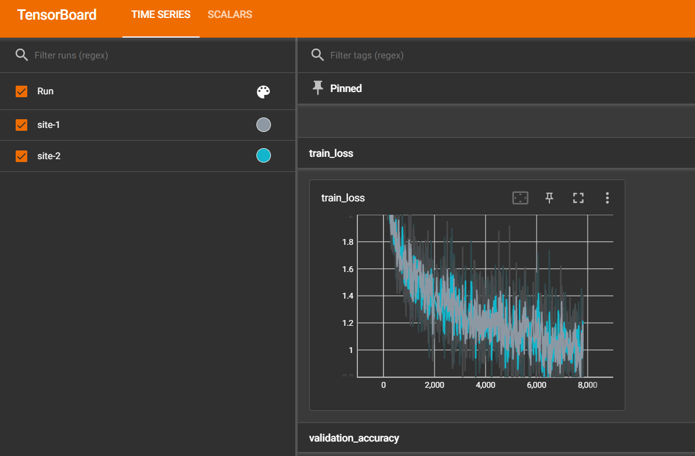

# NVFlare 
Here I present all the test I've done to run nvflare on my windows example. 
I've used the following code to run the tests.

# Docker
First build the docker image using the following command:
```commandline
cd container_ex1
docker build -t nvflare-pt:latest -f Dockerfile .
```

Then, run the docker-compose using the following code:
```commandline
cd nvflare_tests/simulator_cifar_10
docker-compose up --build
```
It will print `hello-world` at each second. Open a new terminal and run the following command:
```commandline
docker-compose exec -it simulater_cifar_10 bash
```

You should be able to see something like the following:
```commandline
root@c578dc34ca69:/workspace#
```

## Check nvflare installation
```commandline
nvflare simulator -h
```
You should be able to see something like the following:
```commandline
usage: nvflare [-h] [--version] {poc,preflight_check,provision,simulator,dashboard,authz_preview} ...

nvflare

optional arguments:
  -h, --help            show this help message and exit
  --version, -V         print nvflare version

subcommands:
  sub command parser

  {poc,preflight_check,provision,simulator,dashboard,authz_preview}
root@c67e14e96261:/workspace/my-workspace# nvflare simulator -h
usage: nvflare simulator [-h] [-w WORKSPACE] [-n N_CLIENTS] [-c CLIENTS] [-t THREADS] [-gpu GPU] [-m MAX_CLIENTS] job_folder

positional arguments:
  job_folder

optional arguments:
  -h, --help            show this help message and exit
  -w WORKSPACE, --workspace WORKSPACE
                        WORKSPACE folder
  -n N_CLIENTS, --n_clients N_CLIENTS
                        number of clients
  -c CLIENTS, --clients CLIENTS
                        client names list
  -t THREADS, --threads THREADS
                        number of parallel running clients
  -gpu GPU, --gpu GPU   list of GPU Device Ids, comma separated
  -m MAX_CLIENTS, --max_clients MAX_CLIENTS
                        max number of clients
```

# Copy the codes
```commandline
cd /workspace/NVFlare
git checkout main
cd /workspace/my-workspace
mkdir simulator-example
cp -rf /workspace/NVFlare/examples/hello-pt-tb simulator-example/
mkdir simulator-example/workspace
```

Considering that I live in Iran and the internet connection is so slow, 
I downloaded the cifar-10 dataset from the following address, and copied it to the `nvflare_tests/simulator_cifar_10/app/data` folder.
1) Download address: https://www.cs.toronto.edu/~kriz/cifar-10-python.tar.gz
2) Copy the downloaded file to the `nvflare_tests/simulator_cifar_10/app/data` folder.
3) Then add the following argument to the `config_fed_client.json` to introduce the dataset path and prevent the container from downloading the dataset:
```commandline
nano simulator-example/hello-pt-tb/app/config/config_fed_client.json
# Add the following line under the `args` section of `components` and `pt_learner.PTLearner`
"data_path": "/workspace/my-workspace/data"
```

Then run the following command which creates two sites for training.
```commandline
nvflare simulator -w simulator-example/workspace -n 2 -t 2 simulator-example/hello-pt-tb
```

After the training is done run the following:
```commandline
tensorboard --logdir simulator-example/workspace/simulate_job/tb_events/
```

In your local system browse the following link:
http://localhost:6006/

You should be able to see the training logs based on different sites:
